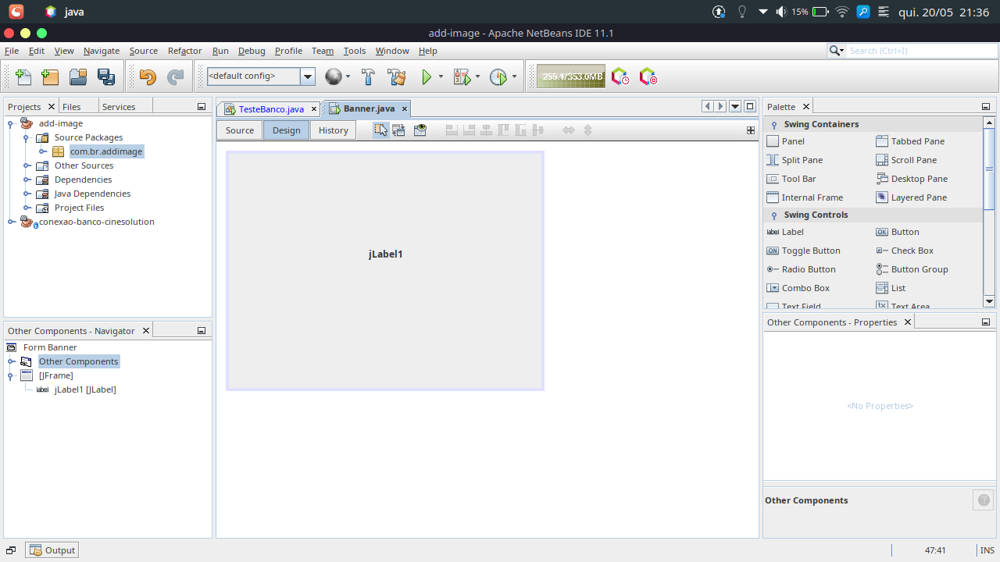

## Estrutura inicial de projetos maven

Seu projeto assim que é criado configurado o maven, deve ter a seguinte estrutura de diretorios.

# Para Adicionar imagens ao JFrame

Criar um diretorio chamado resources conforme imagem abaixo:

Adicionar uma label.

Selecione a label que esta na tela, na seção 'Properties' do componente label, clicar nos '...' e vai abrir o modal abaixo

---

Dentro do diretorio resources, deve estar as imagens do seu projeto Java.

Lembrar de trocar o package para o caminho do resources

# Resultado

